# Agento

[](https://github.com/shaharia-lab/agento/releases)
[](https://github.com/shaharia-lab/agento/stargazers)
[](https://github.com/shaharia-lab/agento/blob/main/LICENSE)
[](https://sonarcloud.io/summary/new_code?id=shaharia-lab_agento)
[](https://sonarcloud.io/summary/new_code?id=shaharia-lab_agento)
[](https://sonarcloud.io/summary/new_code?id=shaharia-lab_agento)

### The missing dashboard for Claude Code.

Claude Code forgets everything the moment it exits. Agento reads the session files it already writes to your disk and turns them into cost analytics, productivity insights and a searchable history of every run. It also gives you a browser UI for building agents, scheduling them, and connecting them to the tools you use.

**One Go binary. No API key, no account, no telemetry. Your history, your agents and your analytics stay on your machine.**

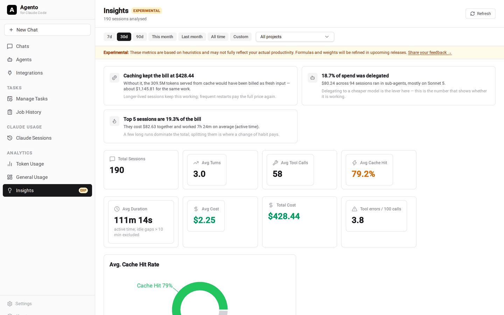

```bash
brew install shaharia-lab/tap/agento
agento web
```

That is the whole setup. Agento opens at `http://localhost:8990`, finds your Claude Code history, and starts building your dashboards.

> ### ⭐ Star this repository
>
> If Agento saves you money or time, a star is the single most useful thing you can do for the project. It takes a second and it is how other Claude Code users find it.

<br>

## Install

**Requirements:** the [Claude Code CLI](https://claude.ai/code), installed and authenticated. If `claude` runs in your terminal, Agento works. No Anthropic API key is needed, because Agento uses the authentication Claude Code already has.

<table>
<tr><td width="50%">

**Homebrew**

```bash
brew install shaharia-lab/tap/agento
agento web
```

</td><td width="50%">

**Direct download**

```bash
# grab the archive for your platform from Releases
tar -xzf agento_Linux_x86_64.tar.gz
sudo mv agento /usr/local/bin/
agento web
```

</td></tr>
</table>

Binaries for Linux (x86_64, arm64), macOS (Intel, Apple Silicon) and Windows are on the [Releases page](https://github.com/shaharia-lab/agento/releases).

Useful flags: `agento web --port 3000` to change the port, `--no-browser` to skip opening a tab. To keep it running in the background across reboots:

```bash
agento service install     # then: status | stop | start | restart | logs | uninstall
```

<br>

## Prefer a desktop app?

Agento also ships as a native desktop app for macOS, Windows and Linux. Same
features, no browser tab and no server to start, with in-app updates on most
install types.

Download it from the [desktop releases](https://github.com/shaharia-lab/agento/releases?q=desktop&expanded=true),
or read the [desktop documentation](desktop/README.md) first.

<br>

## What you get

### Every token type, priced properly

Input, output, cache reads and cache writes bill at very different rates, so Agento keeps them apart instead of multiplying one total by one price. The result is the chart most people find surprising: the model with the most tokens is often not the model taking your money.

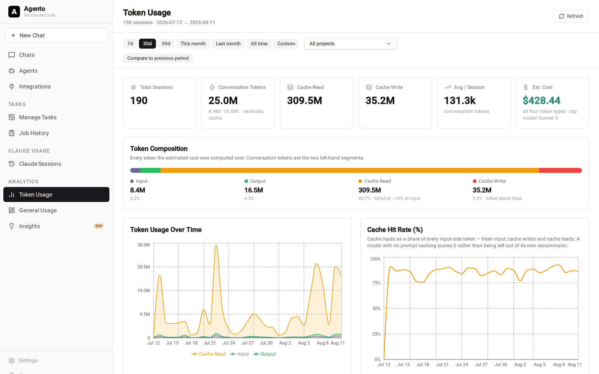

Cost is attributed to the model that spent it, including work done inside sub-agents, so delegating to a cheaper model shows up as an actual saving.

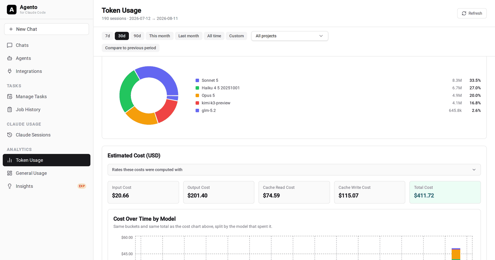

### Find out whether you are getting more effective

The Insights page goes past raw counts. It tracks how many turns a session needed, how far Claude got before it had to ask you something, how long you kept it waiting, cache hit rate and tool error rate, all compared against the previous period so you can see the direction. It then attributes every tool call to the skill, plugin, MCP server or sub-agent responsible, which is how you find the skill quietly burning a third of your calls.

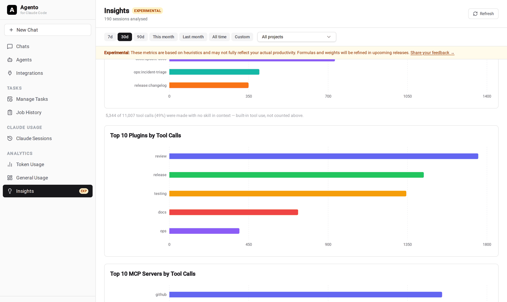

Durations mean active time, not wall clock. Claude Code sessions are resumable, so one picked up a week later would otherwise report a week of work. Idle gaps beyond a threshold you control are excluded everywhere a duration is shown.

### Understand your working patterns

Sessions per day, model mix, busiest days, cost per project, and an activity heatmap that counts a session in every hour it was running rather than only the hour it finished.

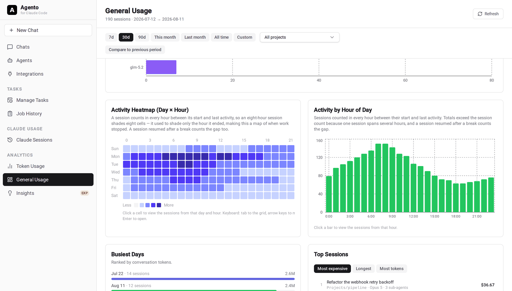

### Browse and search every session you have ever run

Filtered and paged in SQL, so it stays fast whether you have 50 sessions or 5,000. Search across titles and content, filter by project, model, date, cost or duration, and see linked pull requests, git branch and permission mode on every row.

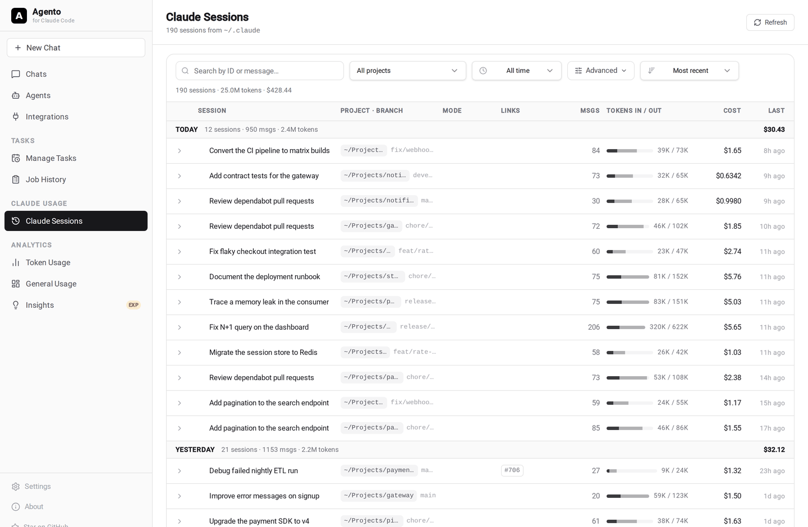

### Replay any session step by step

The journey view reconstructs the full timeline of a run: every prompt, response, tool call and result in order, with each sub-agent's steps nested under the delegation that spawned it. When a long autonomous run goes wrong, this is where you find out where.

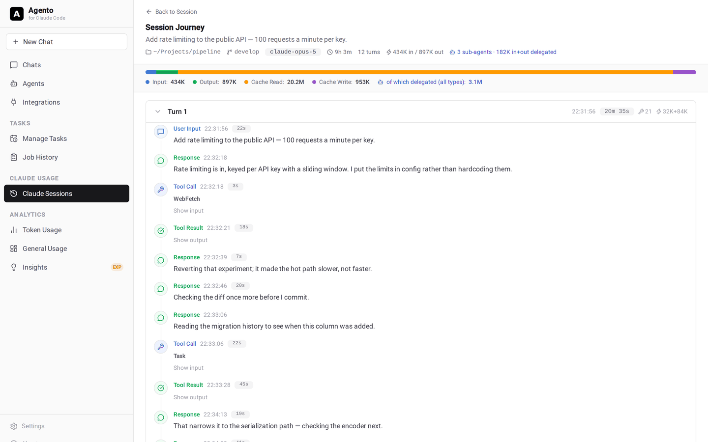

Each session also carries its own metrics: turns, steps per turn, longest autonomous chain, active duration, time Claude spent working, your own average reply time, and tool error rate.

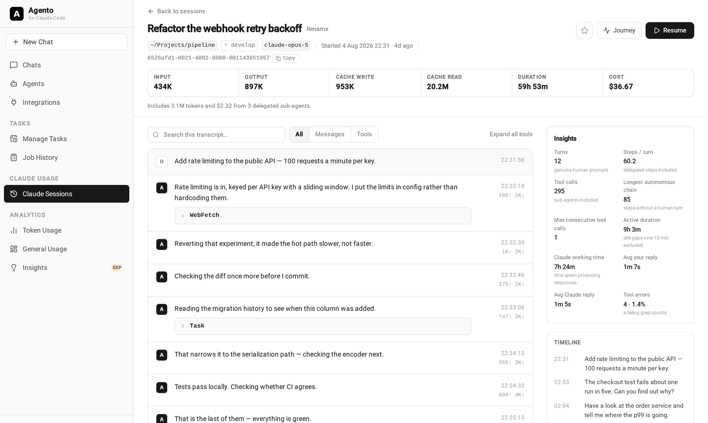

### Build agents without writing code

Give an agent a name, a system prompt, a model, a thinking mode and an explicit list of tools it may use. Save it once and reuse it from the browser, the scheduler or the CLI. Template variables like `{{current_date}}` are filled in at runtime.

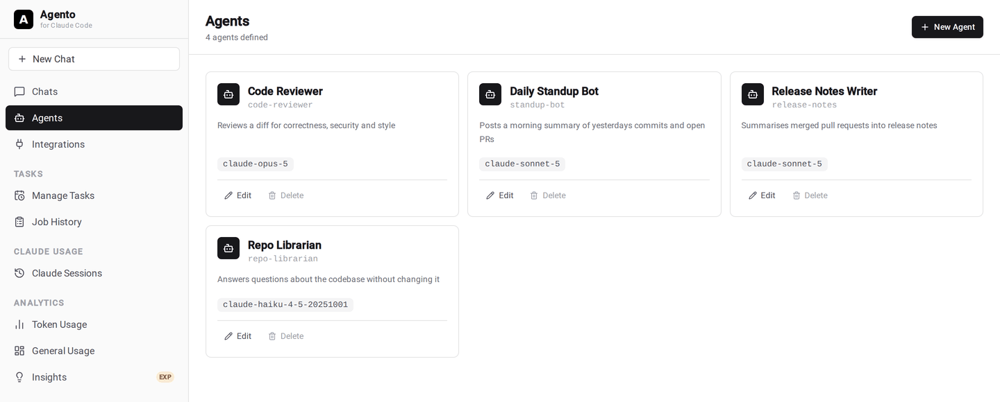

Permission modes matter here: an agent can be set to plan first and act only after you approve, which is what you want the moment it can write files or run commands.

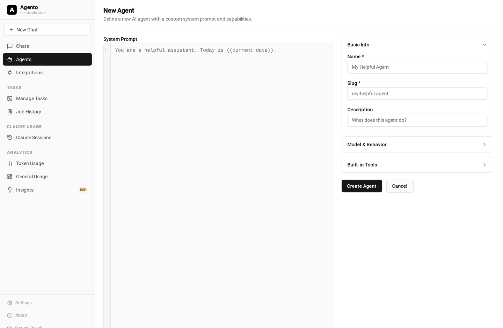

### Put your agents on a schedule

Run any agent on a cron expression, a fixed interval, or once at a specific time. Every execution is recorded with its status, duration and full output, so you can see exactly what ran while you were away.

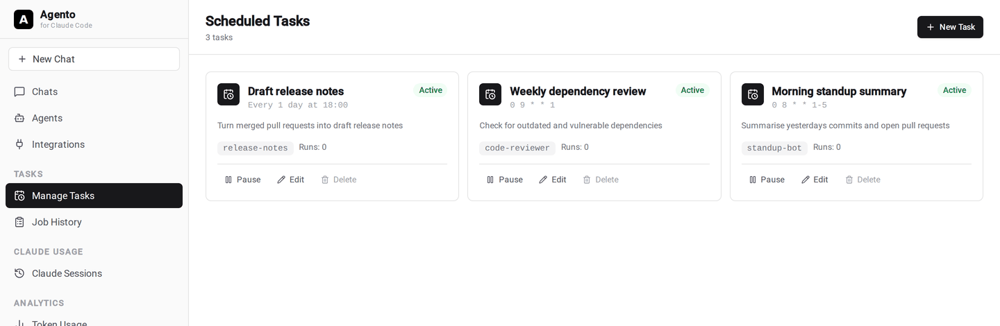

### Connect the tools you already use

Each integration runs as an in-process MCP server, so there is no extra daemon to operate. Configure it once and any agent can use it.

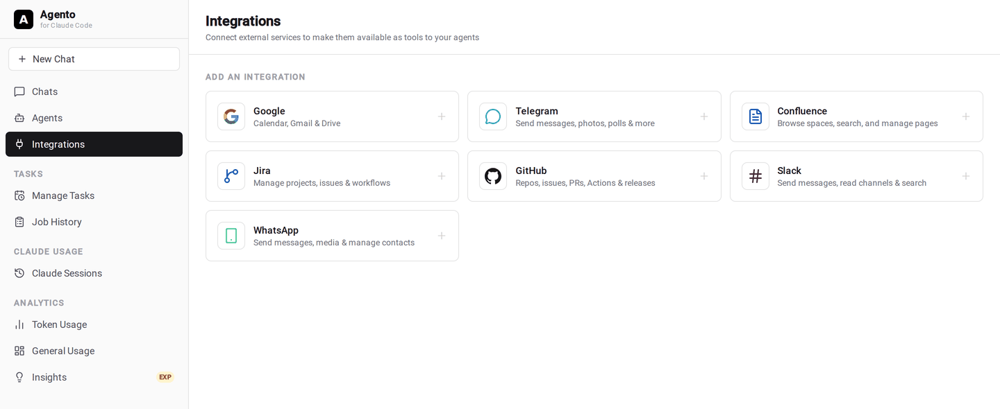

Google (Calendar, Gmail, Drive), GitHub, Slack, Jira, Confluence, Telegram and WhatsApp are built in. Any other MCP server can be added through `~/.agento/mcps.yaml` over stdio, streamable HTTP or SSE.

### Keep the pricing catalog honest

Rates ship for Anthropic, Moonshot, Z.ai and Alibaba models, and they are effective-dated: adding a rate leaves past usage priced at what it was charged, while correcting one rewrites it. A model with no published rate is reported as unknown instead of being quietly priced as something else.

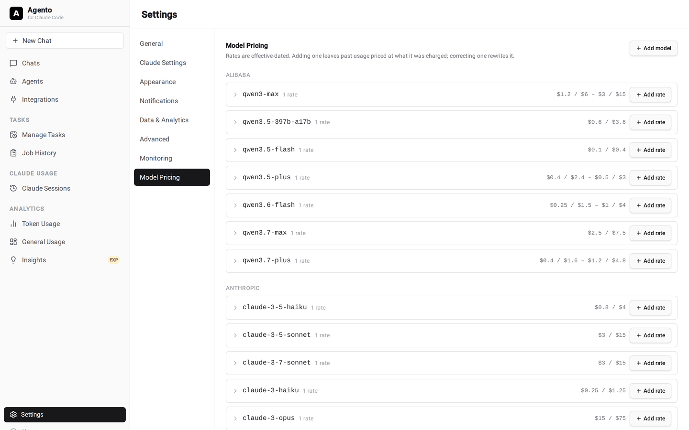

### Your data stays yours

Agento reads `~/.claude` and caches results in a local SQLite database at `~/.agento/agento.db`. Nothing is uploaded, there is no account, and there is no server component. Projects you would rather leave out of the numbers can be hidden from every report, and the idle threshold behind the duration metrics is yours to set.

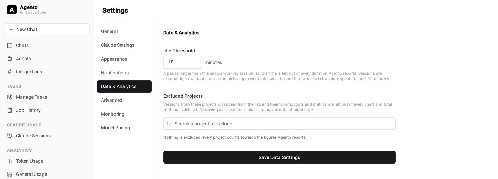

<br>

## Also in the box

<details>
<summary><strong>💬 Chats and a tabbed multi-chat workspace</strong></summary>
<br>

Hold multi-turn conversations with any agent you have built. Responses stream live over Server-Sent Events, sessions persist locally, and you can favourite or rename them. Drag and drop files or paste images straight into the input.

The multi-chat workspace runs several conversations in parallel, each tab with its own agent and session state, and it survives a page reload.

[▶ Watch: chat with an agent](https://github.com/user-attachments/assets/1fa2b716-cbb8-459e-b2e1-f6c252c086c2)

[▶ Watch: the multi-chat workspace](https://github.com/user-attachments/assets/91794133-9f90-4eb0-a62c-885be70b3c39)

</details>

<details>
<summary><strong>💻 CLI: run agents from the terminal</strong></summary>
<br>

```bash
agento ask "What changed in the repo today?"
agento ask --agent code-reviewer "Review the staged diff"
agento ask --agent code-reviewer "Follow up" <session-id>
```

Pass a session ID to continue a conversation. Useful for scripts and shell pipelines.

</details>

<details>
<summary><strong>📡 Observability: OpenTelemetry traces, metrics and logs</strong></summary>
<br>

Every HTTP request, agent run, tool call and storage operation is instrumented. Configure an OTLP gRPC exporter or a Prometheus pull endpoint from the Monitoring settings tab and it hot-reloads, no restart and no config file. Structured logs are written to `~/.agento/logs/system.log`, with per-session logs beside them.

See [docs/monitoring.md](docs/monitoring.md).

</details>

<details>
<summary><strong>🔔 Notifications and job history</strong></summary>
<br>

Configure SMTP delivery for task completion and agent events, send a test message from the UI, and browse the notification log. Every scheduled run is kept in job history with its start time, duration, exit status and full output.

</details>

<details>
<summary><strong>🎨 Claude settings profiles and appearance</strong></summary>
<br>

Keep several named Claude settings profiles (stored as `~/.claude/settings_<slug>.json`) and switch between them per agent or per chat. A default profile is created from your existing `~/.claude/settings.json` on first launch. Dark and light themes, font size and font family apply instantly across the UI.

</details>

<details>
<summary><strong>🔄 Auto-update</strong></summary>
<br>

Agento checks for new releases on startup and shows a banner when one is available. Run `agento update` to upgrade in place. If it is installed as a background service, the service is restarted for you.

</details>

<br>

## Configuration

Nothing needs configuring. Everything below is optional, and environment variables win over the Settings UI.

<details>
<summary><strong>Environment variables</strong></summary>
<br>

| Variable | Default | Description |
|----------|---------|-------------|
| `PORT` | `8990` | HTTP server port |
| `AGENTO_BIND` | `127.0.0.1` | Interface to listen on (both loopback families). Set `0.0.0.0` to reach Agento from another device — see below |
| `AGENTO_PUBLIC_URL` | none | Externally reachable URL, for a reverse proxy, a tunnel, or Telegram webhooks |
| `CLAUDE_CONFIG_DIR` | `~/.claude` | Which Claude Code account agents run as. Claude Code's own variable |
| `AGENTO_DATA_DIR` | `~/.agento` | Root directory for agents, chats, and logs. Supports `~` expansion |
| `LOG_LEVEL` | `info` | Log verbosity: `debug`, `info`, `warn`, `error` |
| `ANTHROPIC_API_KEY` | none | Use the Anthropic API directly instead of Claude Code CLI authentication |
| `AGENTO_DEFAULT_MODEL` | Claude default | Lock the model used for direct chat sessions |
| `AGENTO_WORKING_DIR` | `/tmp/agento/work` | Default working directory for agent sessions |
| `OTEL_EXPORTER_OTLP_ENDPOINT` | none | OTLP gRPC collector endpoint, for example `localhost:4317` |
| `OTEL_METRICS_EXPORTER` | none | `otlp` to push, or `prometheus` to expose `/metrics` |
| `OTEL_LOGS_EXPORTER` | none | `otlp` |

</details>

<details>
<summary><strong>CLI reference</strong></summary>
<br>

```
agento web [--port int] [--no-browser]      Start the web UI
agento ask [--agent slug] [--no-thinking]   Ask an agent a one-off question
           <question> [session-id]
agento update [-y] [--no-restart]           Update to the latest release
agento service <install|uninstall|start|stop|restart|status|logs>
```

`agento service` installs a LaunchAgent on macOS (`~/Library/LaunchAgents/com.shaharialab.agento.plist`) or a systemd user unit on Linux (`~/.config/systemd/user/agento.service`), so Agento survives logout and reboot.

</details>

<details>
<summary><strong>Build from source</strong></summary>
<br>

Requires Go 1.25+ and Node.js.

```bash
git clone https://github.com/shaharia-lab/agento.git
cd agento
make build
```

See [docs/development.md](docs/development.md) for the architecture overview and the development workflow.

</details>

<br>

### Reaching Agento from another device

Agento listens on **loopback only** by default, and has **no authentication** — it is meant to run on the machine you are working at. The API can create an agent and run it, so anything that can reach it can run commands on that machine.

To use it from a phone, tablet or another computer:

```bash
AGENTO_BIND=0.0.0.0 agento web
```

Only do that on a network you trust, or put a proxy that authenticates in front of it. If you reach Agento under a hostname rather than an IP — through a reverse proxy or a tunnel — set **Public URL** in Settings (or `AGENTO_PUBLIC_URL`) to that address, or requests will be refused.

> **Upgrading?** This used to listen on every interface. If you reach Agento from another device and it stopped working, set `AGENTO_BIND=0.0.0.0`. The startup log names the interface it bound.

## Documentation

- [Getting started](docs/getting-started.md): setup and a first-run walkthrough
- [Claude sessions](docs/claude-sessions.md): what is scanned, how cost and duration are measured, and the analytics built on top
- [Agents](docs/agents.md): system prompts, models, tools and template variables
- [Tasks](docs/tasks.md): running agents on a schedule, and job history
- [Integrations](docs/integrations.md): connecting Google, GitHub, Slack, Jira, Confluence, Telegram and WhatsApp
- [Pricing](docs/pricing.md): how cost is calculated and how to maintain the catalog
- [Security](docs/security.md): network exposure, the API guards, and where your data lives
- [Monitoring](docs/monitoring.md): OpenTelemetry traces, metrics and logs
- [Development](docs/development.md): architecture and contribution guidelines

**Desktop app**

- [Installation](desktop/docs/installation.md): downloads per platform, updates, and where your data lives
- [User guide](desktop/docs/user-guide.md): every section of the app
- [Troubleshooting](desktop/docs/troubleshooting.md): common problems and the logs
- [Architecture](desktop/docs/architecture.md) and [development](desktop/docs/development.md): for contributors

<br>

## Contributing

Issues and pull requests are welcome. Missing a feature? [Open an issue](https://github.com/shaharia-lab/agento/issues/new) and tell us what you would use it for.

<br>

## License

MIT. Maintained by [Shaharia Lab](https://github.com/shaharia-lab).

<br>

<div align="center">

**Agento is free and open source.**
If it is useful to you, [star the repository](https://github.com/shaharia-lab/agento) so more Claude Code users find it.

[⭐ Star Agento](https://github.com/shaharia-lab/agento) · [Download](https://github.com/shaharia-lab/agento/releases) · [Report an issue](https://github.com/shaharia-lab/agento/issues/new)

</div>
