<div align="center">

# Agento

### See what Claude Code really costs you, replay any session, and put agents to work — from one desktop app.

Agento reads the session files Claude Code already writes to your disk and turns them into
cost analytics, productivity insights and a searchable, replayable history of every run.
It also lets you build agents, chat with them, schedule them, and connect them to the tools you use.
**No API key, no account, no telemetry. Everything stays on your machine.**

[](https://github.com/shaharia-lab/agento/releases/latest)
[](https://github.com/shaharia-lab/agento/actions/workflows/ci.yml)
[](https://github.com/shaharia-lab/agento/releases)
[](https://github.com/shaharia-lab/agento/stargazers)
[](LICENSE)
[](https://github.com/shaharia-lab/agento/commits/main)

**[Install](#-install) · [What you get](#-what-you-get) · [Shortcuts](#%EF%B8%8F-keyboard-shortcuts) · [Docs](docs/README.md) · [Contributing](#-contributing)**

<br>

### ⭐ Like the idea? [Star the repo.](https://github.com/shaharia-lab/agento)

It takes two seconds, and it is how the next Claude Code user finds Agento.

</div>

---

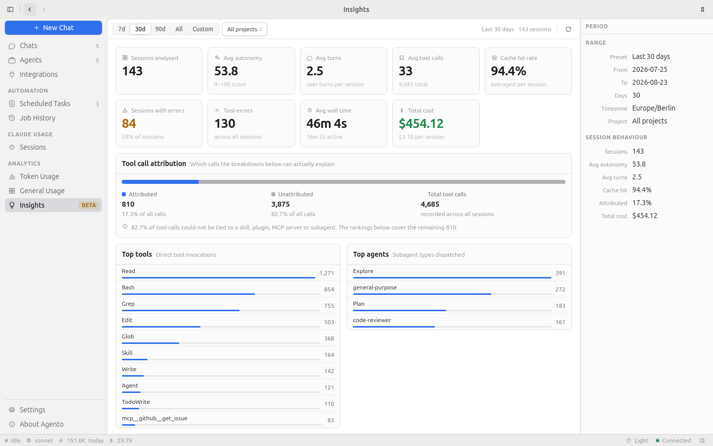

---

## ⚡ Install

Three steps, about a minute. Agento runs on macOS, Windows and Linux.

<details open>
<summary><b>1. Have Claude Code</b> — installed and signed in</summary>

<br>

Agento runs every agent through the **[Claude Code CLI](https://claude.ai/code)** you already
have and reuses its sign-in. If `claude` works in your terminal, you are ready. There is no
Anthropic API key to enter; the app tells you on launch if the CLI is missing.

</details>

<details open>
<summary><b>2. Download</b> — pick your platform from the <a href="https://github.com/shaharia-lab/agento/releases/latest">latest release</a></summary>

<br>

| Platform | File | Updates |
| --- | --- | --- |
| **macOS** Apple Silicon / Intel | `Agento_<version>_aarch64.dmg` / `_x64.dmg` | In-app |
| **Windows** x64 | `Agento_<version>_x64-setup.exe` | In-app |
| **Linux** any distro | `Agento_<version>_amd64.AppImage` / `_aarch64.AppImage` | In-app |
| **Linux** Debian / Ubuntu | `Agento_<version>_amd64.deb` / `_arm64.deb` | Notify only |
| **Linux** Fedora / RHEL / openSUSE | `Agento-<version>-1.x86_64.rpm` / `.aarch64.rpm` | Notify only |

**In-app** means Agento downloads, verifies and installs the next version itself. `.deb`
and `.rpm` are owned by your package manager, so Agento only tells you when one exists.
Want in-app updates on Linux? Take the AppImage. Every file ships with a `.sig` from
Agento's own update key.

<details>
<summary>macOS — first launch</summary>

<br>

Drag **Agento** into Applications and open it. macOS blocks it once, because the app is
not signed with an Apple Developer certificate: go to **System Settings → Privacy &
Security**, scroll down, click **Open Anyway**. Updates installed by the app never ask again.

</details>

<details>
<summary>Windows — first launch</summary>

<br>

Run the installer. SmartScreen warns about an unrecognised publisher: click **More info**,
then **Run anyway**. It asks for administrator rights because it installs for all users,
and brings its own WebView2 runtime if your machine has none.

</details>

<details>
<summary>Linux — AppImage, deb, rpm</summary>

<br>

```bash
chmod +x Agento_*.AppImage && ./Agento_*.AppImage     # no install, no root, updates in place
sudo apt install ./Agento_*_amd64.deb                   # Debian, Ubuntu
sudo dnf install ./Agento-*.x86_64.rpm                  # Fedora, RHEL, openSUSE
```

The packages declare their GTK and WebKitGTK dependencies; your package manager resolves them.

</details>

Full details, including building from source, in the [installation guide](docs/installation.md).

</details>

<details open>
<summary><b>3. Launch</b> — your history is already there</summary>

<br>

Agento opens on **Chats** and starts indexing the Claude Code history on your disk. A large
history takes a few minutes the first time; the Sessions view shows progress and everything
else works meanwhile. Your data lives in `~/.agento` (`%USERPROFILE%\.agento` on Windows)
as one SQLite file. Nothing is uploaded anywhere.

</details>

> [!TIP]
> `Ctrl K` (`⌘ K` on macOS) opens the command palette from anywhere — every view, action
> and setting is one keystroke away. The rest of the [shortcuts](#%EF%B8%8F-keyboard-shortcuts) are below.

---

## 🧭 What you get

### Every token type, priced properly

Input, output, cache reads and cache writes bill at very different rates, so Agento keeps
them apart instead of multiplying one total by one price. The model with the most tokens
is often not the model taking your money.

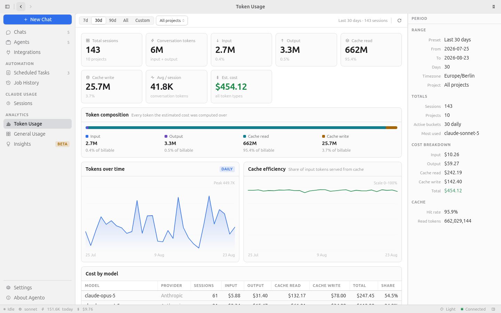

Cost is attributed to the model that spent it — sub-agents included — and to the project.

<details>
<summary>Show screenshot</summary>

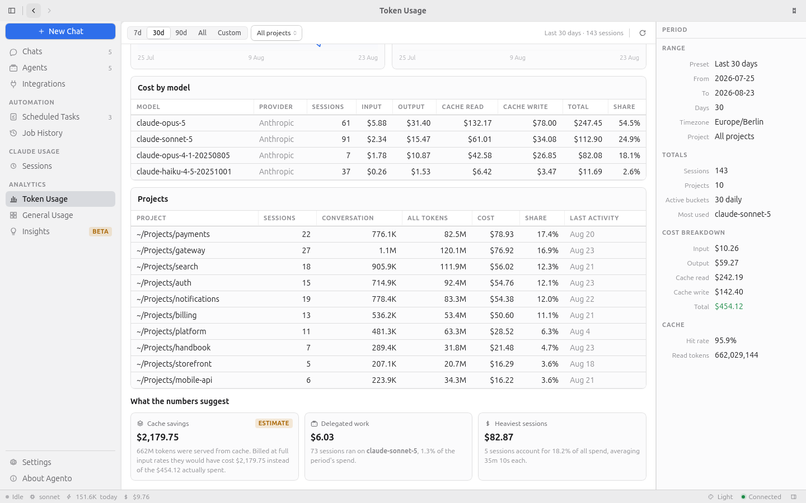

</details>

### Find out whether you are getting more effective

Insights goes past raw counts: turns per session, how far Claude got before it had to ask
you something, cache hit rate, tool error rate — then every tool call attributed to the
skill, plugin, MCP server or sub-agent responsible. Durations mean **active** time; idle
gaps beyond a threshold you set are excluded everywhere.

<details>
<summary>Show screenshot</summary>

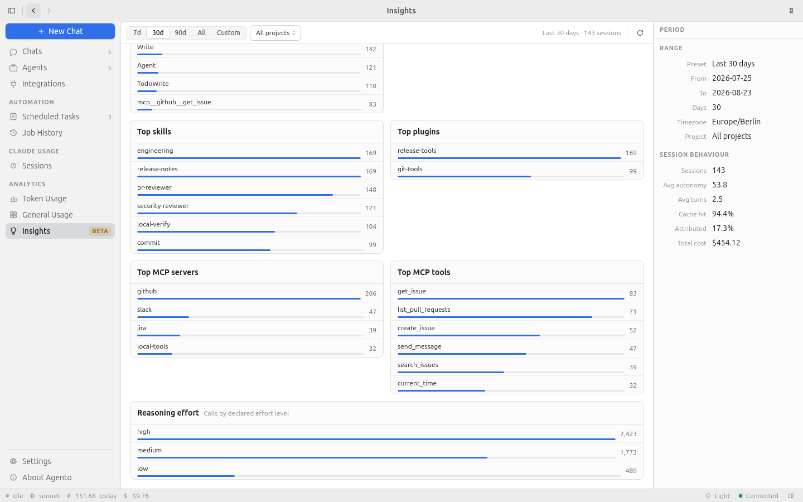

</details>

### Understand your working patterns

Sessions per day, model mix, busiest days, and a weekly heatmap that counts a session in
every hour it was running, not only the hour it finished.

<details>
<summary>Show screenshot</summary>

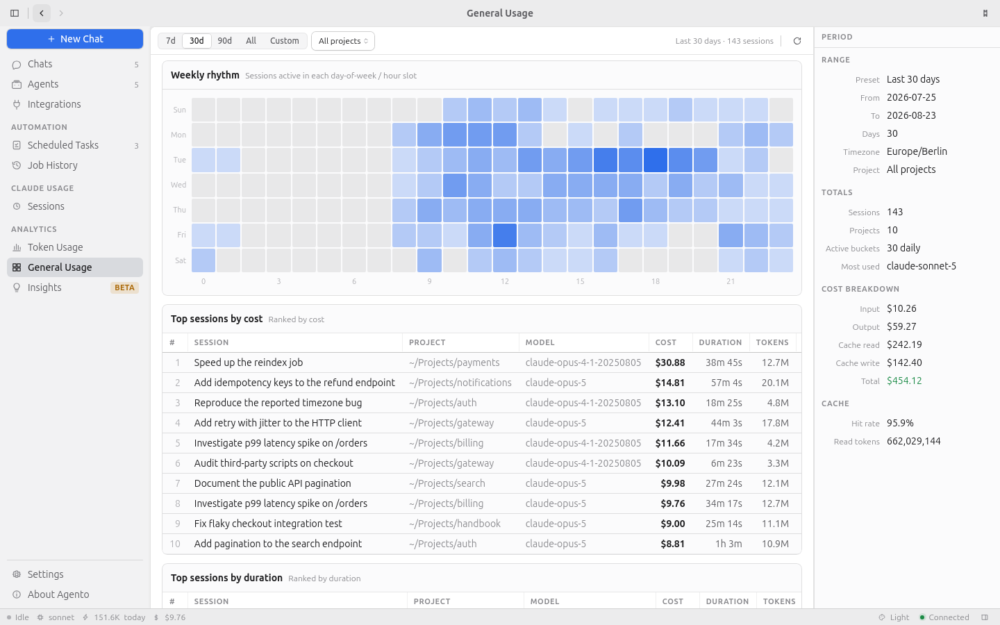

</details>

### Browse and search every session you have ever run

Filtered and paged in SQL, so it stays fast at 5,000 sessions. Search titles and content;
filter by project, model, date, cost or duration; see permission mode, linked pull
requests, tokens and cost on every row, with the inspector beside it.

<details>
<summary>Show screenshot</summary>

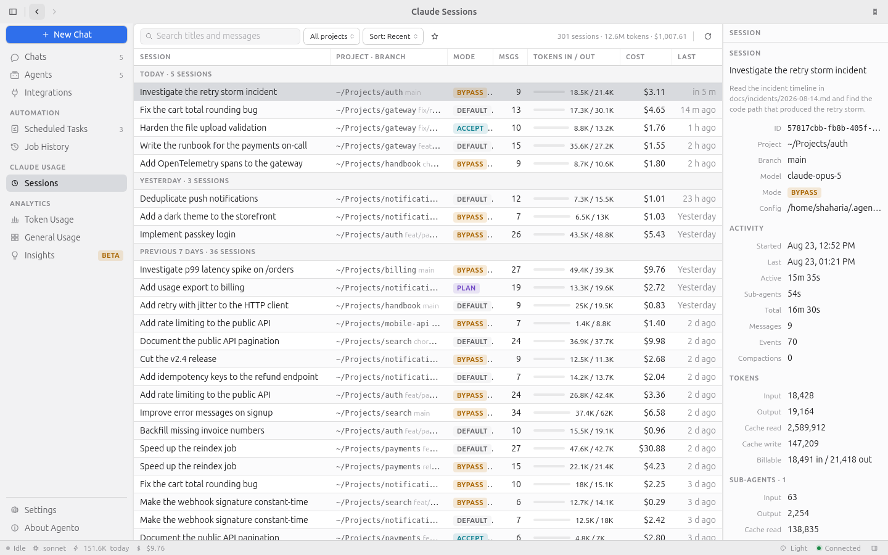

</details>

### Replay any session step by step

Open a session and read the whole run in order — every prompt, response, tool call and
result, with sub-agent delegations and failing commands where they happened. When a long
autonomous run goes wrong, this is where you find out where.

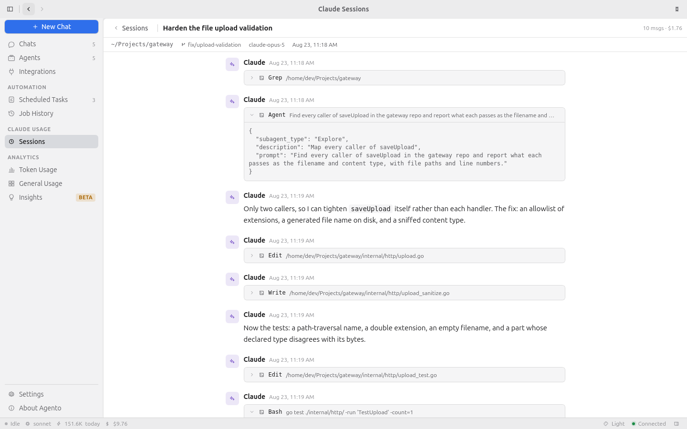

<details>
<summary>Show the session's own metrics</summary>

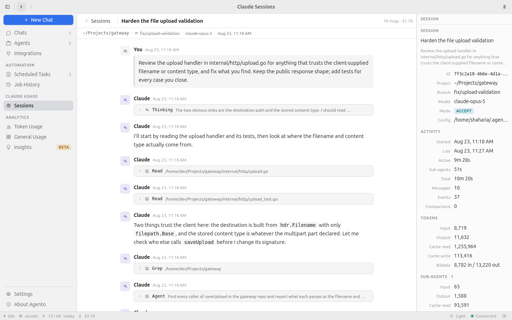

</details>

### Chat with agents you built yourself

Give an agent a name, a system prompt, a model, a thinking mode and an explicit allowlist
of tools; `{{current_date}}`-style variables are filled in at runtime. Then chat with it
in the app — every turn runs through your own Claude Code CLI, tool calls and Markdown
render inline, and the inspector shows what it cost.

<details>
<summary>Show screenshots</summary>

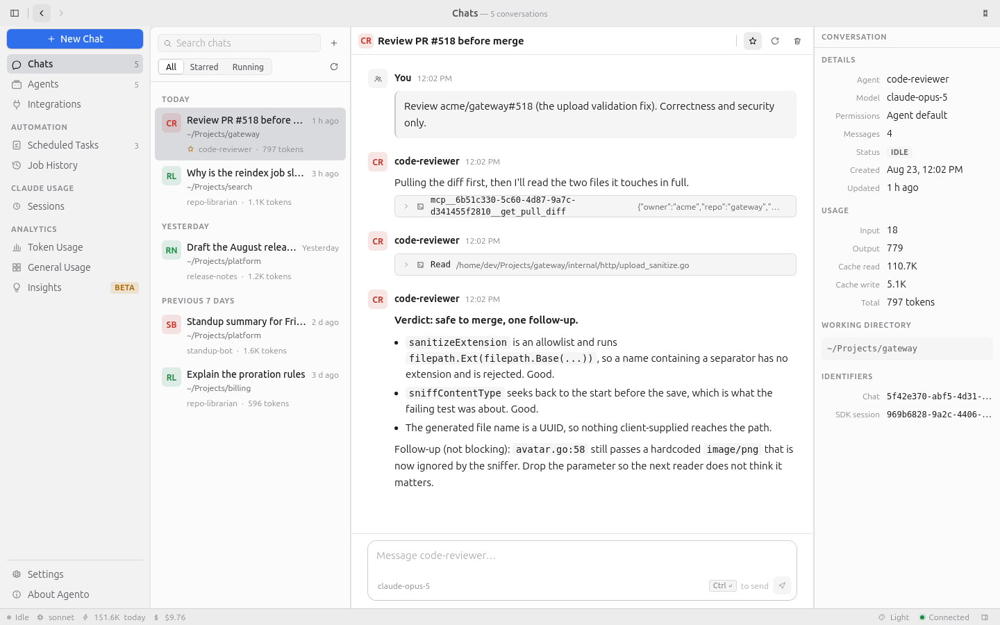

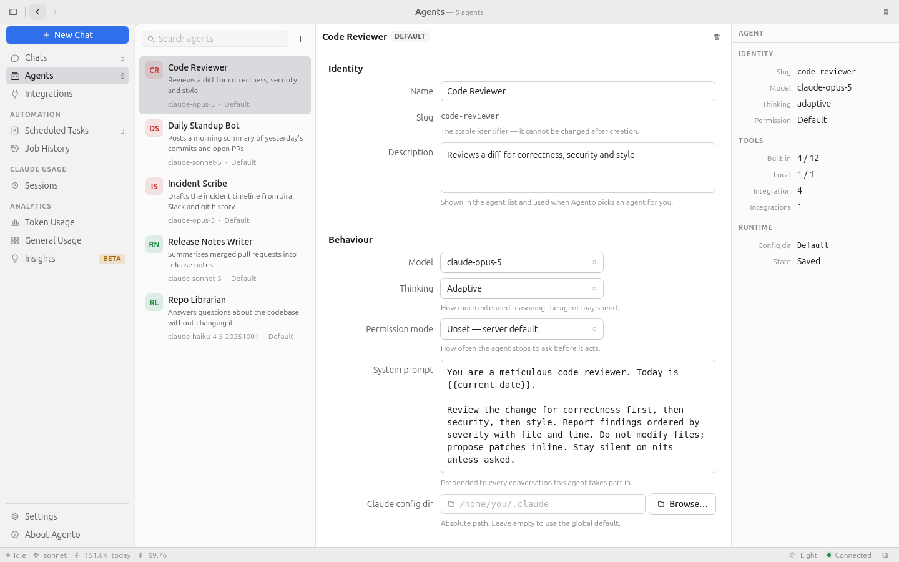

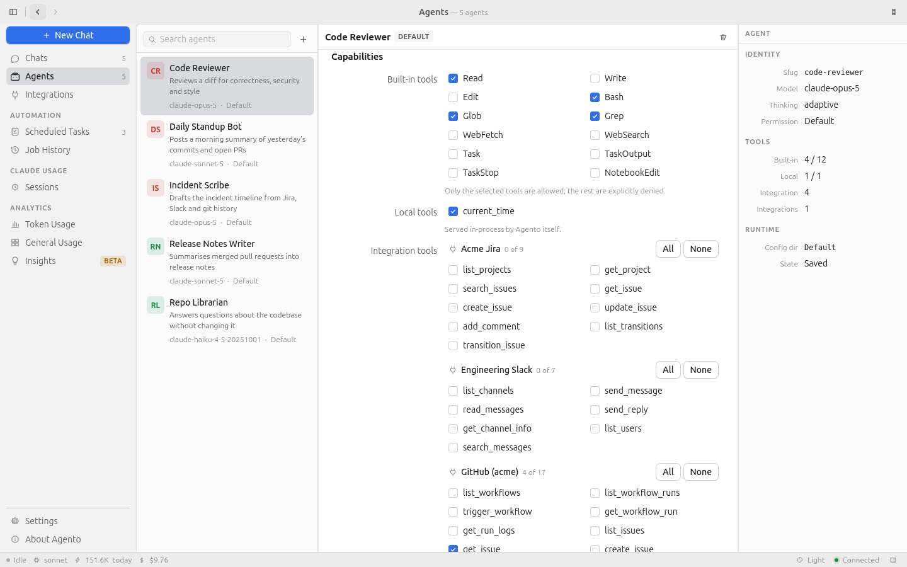

</details>

### Put agents on a schedule

Cron, fixed interval, or once at a given time. Every run is recorded with status, duration
and full output, so you can see exactly what happened while you were away.

<details>
<summary>Show screenshot</summary>

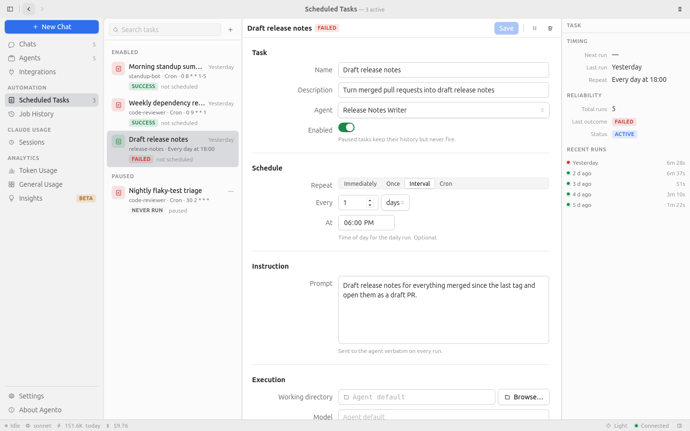

</details>

### Connect the tools you already use

GitHub, Slack, Jira, Confluence, Telegram and Google (Calendar, Gmail, Drive) are built in,
each running as an MCP server inside the app — no extra daemon. Any other MCP server can be
added through `~/.agento/mcps.yaml`.

<details>
<summary>Show screenshot</summary>

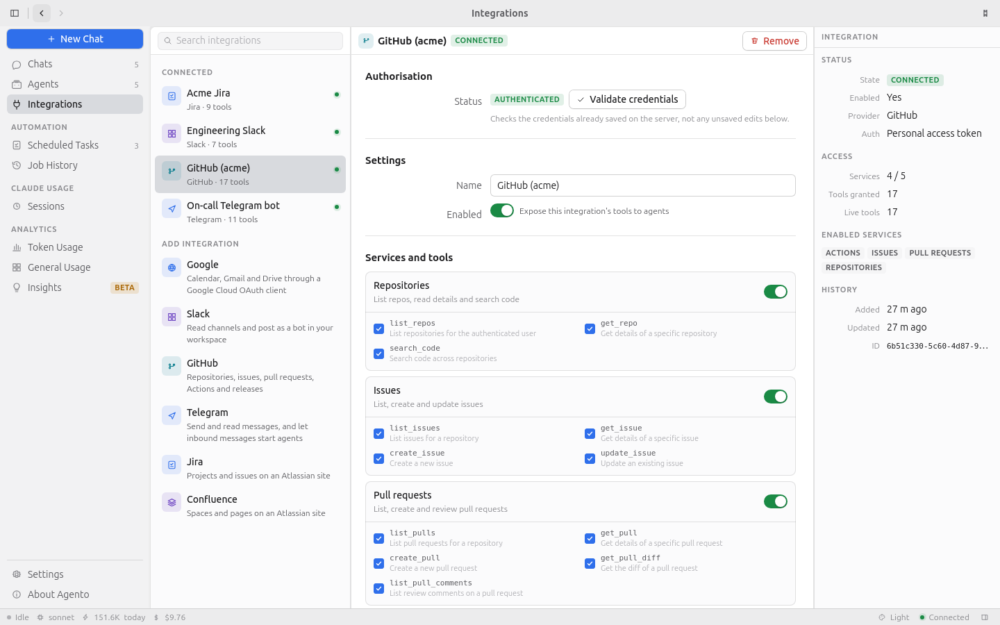

</details>

### Honest pricing, your data

Rates for Anthropic, Moonshot, Z.ai and Alibaba models ship with the app and are
effective-dated; a model with no published rate is reported as unknown rather than priced
as something else. Agento reads `~/.claude` and caches into a local SQLite file — there is
no account and no server. Hide projects from every report, set the idle threshold yourself.

<details>
<summary>Show screenshots</summary>

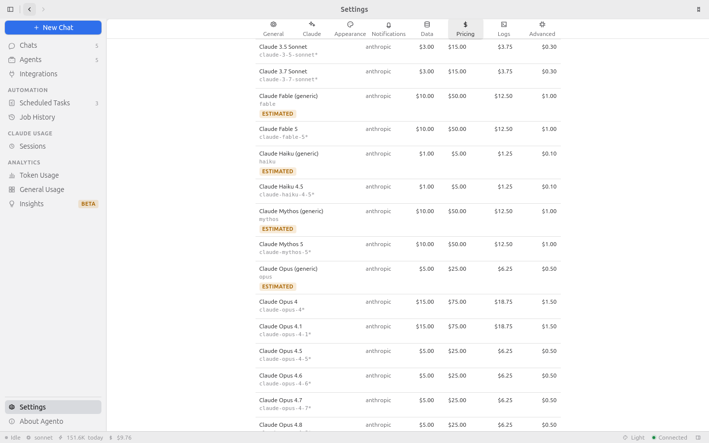

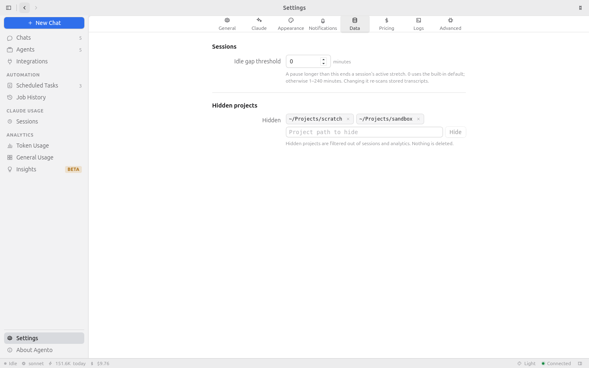

</details>

*Screenshots are taken from the app over a synthetic dataset — see
[`docs/screenshots/README.md`](docs/screenshots/README.md).*

---

## ⌨️ Keyboard shortcuts

`Ctrl` on Windows and Linux, `⌘` on macOS.

| Shortcut | Action | Shortcut | Action |
| --- | --- | --- | --- |
| `Ctrl K` | Command palette | `Ctrl B` | Show / hide the sidebar |
| `Ctrl N` | New chat | `Ctrl I` | Show / hide the inspector |
| `Ctrl ,` | Settings | `Ctrl [` / `Ctrl ]` | Back / forward |
| `Ctrl 1` … `Ctrl 7` | Jump to a section | | |

---

## ⭐ Spread the word

Made it this far? Then Agento is probably useful to you — and the fastest way to keep it
alive is to make it easier for the next person to find.

<div align="center">

**[⭐ Star Agento](https://github.com/shaharia-lab/agento)** ·
**[💬 Say hello in Discussions](https://github.com/shaharia-lab/agento/discussions)** ·
**[🐛 Report something broken](https://github.com/shaharia-lab/agento/issues)**

<br>

**Share it with one person who uses Claude Code**

[](https://twitter.com/intent/tweet?text=Agento%20%E2%80%94%20see%20what%20Claude%20Code%20really%20costs%20you%2C%20replay%20any%20session%2C%20and%20put%20agents%20to%20work.%20Local%2C%20no%20API%20key.&url=https%3A%2F%2Fgithub.com%2Fshaharia-lab%2Fagento)
[](https://www.linkedin.com/sharing/share-offsite/?url=https%3A%2F%2Fgithub.com%2Fshaharia-lab%2Fagento)
[](https://bsky.app/intent/compose?text=Agento%20%E2%80%94%20see%20what%20Claude%20Code%20really%20costs%20you%2C%20replay%20any%20session%2C%20and%20put%20agents%20to%20work.%20Local%2C%20no%20API%20key.%20https%3A%2F%2Fgithub.com%2Fshaharia-lab%2Fagento)
[](https://www.reddit.com/submit?url=https%3A%2F%2Fgithub.com%2Fshaharia-lab%2Fagento&title=Agento%20%E2%80%94%20see%20what%20Claude%20Code%20really%20costs%20you%2C%20replay%20any%20session%2C%20and%20put%20agents%20to%20work)
[](https://news.ycombinator.com/submitlink?u=https%3A%2F%2Fgithub.com%2Fshaharia-lab%2Fagento&t=Agento%20%E2%80%94%20see%20what%20Claude%20Code%20really%20costs%20you%2C%20replay%20any%20session%2C%20and%20put%20agents%20to%20work)

</div>

In rough order of usefulness:

- ⭐ **Star the repo** — the single highest-leverage thing.
- 🐛 **Open an issue** when something breaks or a view feels wrong.
- 💬 **Tell one person** who uses Claude Code every day.
- ✍️ **Write about it** — a blog post, a work Slack message, a comment on HN or Reddit.
- 🛠️ **Send a PR** — see [Contributing](#-contributing) below.

<details>
<summary>Star history</summary>

<br>

<a href="https://star-history.com/#shaharia-lab/agento&Date">
  <picture>
    <source media="(prefers-color-scheme: dark)" srcset="https://api.star-history.com/svg?repos=shaharia-lab/agento&type=Date&theme=dark" />
    
  </picture>
</a>

</details>

---

## 📚 Documentation

Everything lives in [`docs/`](docs/README.md).

<table>
<tr>
<td valign="top" width="50%">

**User guide** — how to *use* it

- [Installation](docs/installation.md)
- [User guide](docs/user-guide.md): chats, agents, integrations, scheduled tasks, sessions, analytics, settings
- [Troubleshooting](docs/troubleshooting.md)

</td>
<td valign="top" width="50%">

**Developer docs** — how to *work on* it

- [Development](docs/development.md)
- [Architecture](docs/architecture.md)
- [Releasing](docs/releasing.md)

<br>

```bash
npm install
npm run app          # dev window, hot reload
npm run app:build    # installers for this platform
```

</td>
</tr>
</table>

---

## 🤝 Contributing

Contributions are very welcome. Open an issue first describing **what** and **why**, wait
for triage, then send a PR that links it. Start with
[`good first issue`](https://github.com/shaharia-lab/agento/issues?q=is%3Aissue+is%3Aopen+label%3A%22good+first+issue%22)
or [`help wanted`](https://github.com/shaharia-lab/agento/issues?q=is%3Aissue+is%3Aopen+label%3A%22help+wanted%22).
The full policy is in [CONTRIBUTING.md](CONTRIBUTING.md); security issues go through
[SECURITY.md](SECURITY.md), never a public issue.

<a href="https://github.com/shaharia-lab/agento/graphs/contributors">
  
</a>

## 📄 License

[MIT](LICENSE) — do what you like, no warranty.

Built with [Tauri](https://tauri.app) and [Rust](https://www.rust-lang.org) · runs on the
[Claude Code CLI](https://claude.ai/code) you already have.

<div align="center">
<br>

**Made with ❤️ by [Shaharia Lab](https://github.com/shaharia-lab)**

⭐ [Star Agento](https://github.com/shaharia-lab/agento) if it saved you money or time.

</div>
