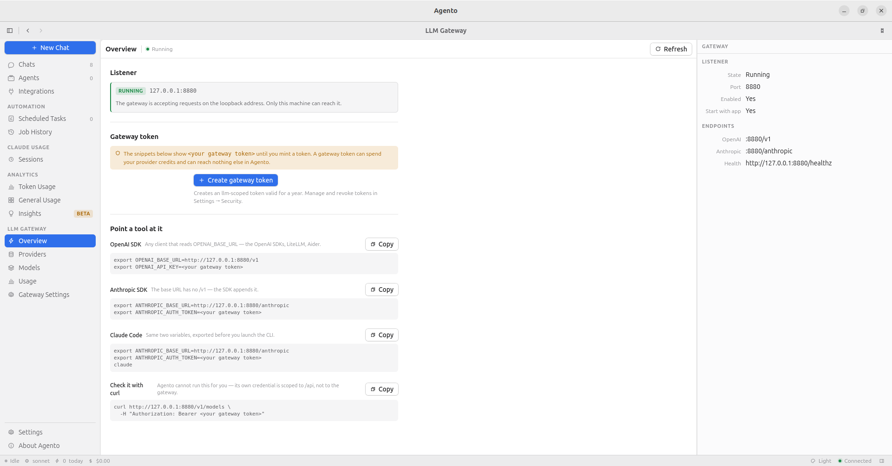
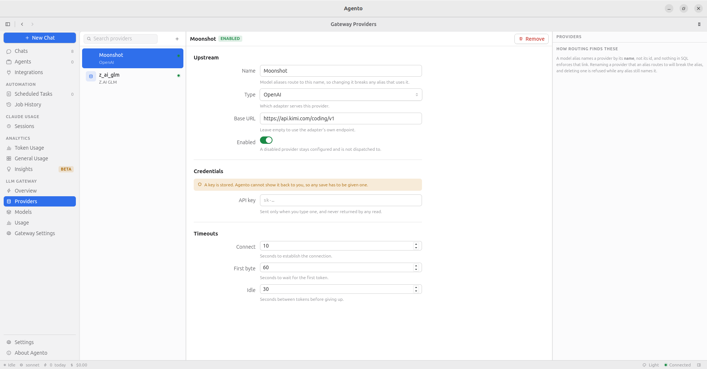
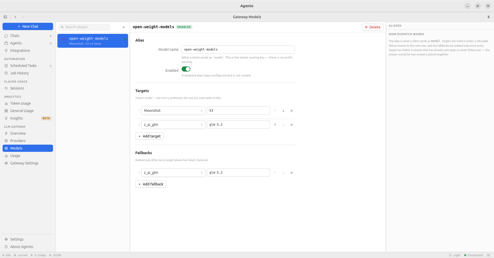
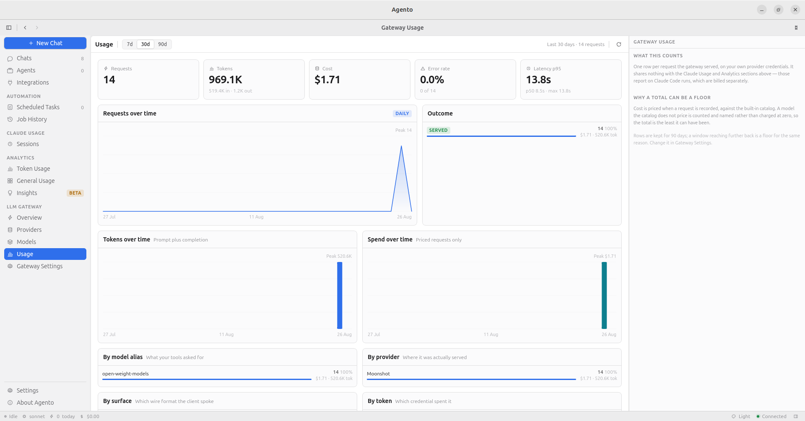
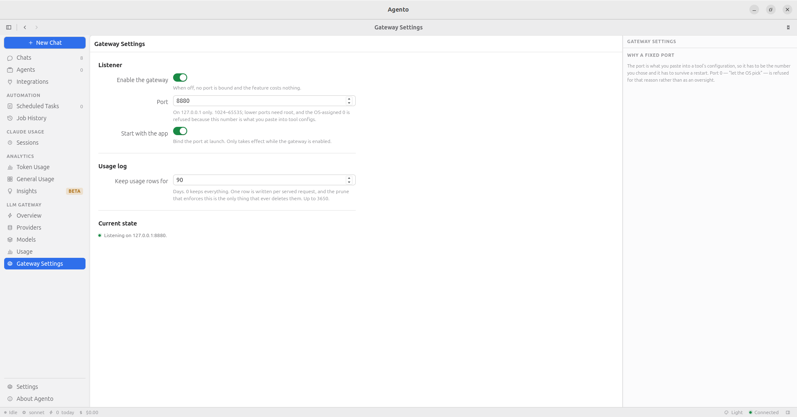

# User Guide

How to use Agento Desktop, section by section.

New here? Install first: [Installation](installation.md).

- [The window](#the-window)
- [Chats](#chats)
- [Agents](#agents)
- [Integrations](#integrations)
- [Scheduled tasks](#scheduled-tasks)
- [Job history](#job-history)
- [Claude sessions](#claude-sessions)
- [Analytics](#analytics)
- [LLM Gateway](#llm-gateway)
- [Settings](#settings)
- [Privacy](#privacy)

---

## The window

Agento is one window with four parts.

```
┌──────────────────────────────────────────────────────┐
│ titlebar: back, forward, sidebar toggle              │
├─────────┬────────────────────────────────────────────┤
│ sidebar │ toolbar                                    │
│         ├──────────┬──────────────────┬──────────────┤
│ sections│ list     │ detail           │ inspector    │
├─────────┴──────────┴──────────────────┴──────────────┤
│ status bar: running agents, model, today's spend     │
└──────────────────────────────────────────────────────┘
```

- **Sidebar**: the sections of the app. `Ctrl B` hides it.
- **List**: what is in the current section. Search and filters sit above it.
- **Detail**: the thing you selected.
- **Inspector**: facts and figures about that thing. `Ctrl I` hides it.
- **Status bar**: always live. Running agents, the active model, today's tokens
  and spend, and connection state.

Drag the thin lines between panes to resize them. The app remembers your window
size and position between launches.

### Getting around fast

Press `Ctrl K` (or `⌘K`) for the command palette. Type a few letters of what you
want and press Enter. It reaches every section and the common actions.

| Shortcut | Action |
| --- | --- |
| `Ctrl K` | Command palette |
| `Ctrl N` | New chat |
| `Ctrl ,` | Settings |
| `Ctrl B` | Sidebar |
| `Ctrl I` | Inspector |
| `Ctrl [` / `Ctrl ]` | Back / forward |
| `Ctrl 1` to `Ctrl 7` | Jump to a section |

On macOS use `⌘` instead of `Ctrl`, and the menu bar carries the same actions.

---

## Chats

A chat is a conversation with an agent, kept for as long as you want it.

**Start one:** press `Ctrl N` or click the `+` above the chat list. Set up how the
conversation should run, then type your first message. The chat is created when
you send.

| Setting | What it does |
| --- | --- |
| **Agent** | Which saved agent to talk to, or none for a direct chat. Hidden until you have created one |
| **Model** | Sonnet, Opus or Haiku. Locked when the agent already names one, because the agent's wins |
| **Permissions** | How much this conversation may do without asking. See below |
| **Settings** | Which Claude settings profile to run under, if you have more than one |
| **Working directory** | Required. The folder the agent can see and act in |

The working directory matters. It is the folder the agent can see and act in, the
same way `claude` behaves when you run it from that folder. **Browse…** opens your
system's file picker, falling back to a built-in one if that is unavailable.

Your choices are remembered and filled in next time you start a chat. They start
from **Settings → General** the first time.

**Replies are rendered as markdown** — headings, lists, tables, links and code
blocks. Hover a message for a **copy** button, and any code block for its own.
Copying a message gives you the markdown source, which is what you want when it
is going into an issue or a commit message.

**While a turn is running:**

- The reply streams in as it is produced.
- Tool calls appear inline, with the input and the result.
- If the agent needs permission for a tool, a prompt appears. Approve or deny.
  Chats set to *Never ask* skip this.
- If the agent asks you a question, answer it in the composer and the run
  continues.
- **Stop** halts the run. Anything already written stays.

**The inspector** shows the agent, the model, the permission mode, the message
count and the token usage of the whole conversation, split into input, output,
cache read and cache write, with the cost.

Rename a chat from the title, or delete it from the toolbar. Deleting removes its
messages too.

**One thing worth knowing:** a turn that produced no final answer, for example one
you stopped immediately, stores nothing. That is the same rule Claude Code
follows.

### Permissions, per conversation

The **Permissions** setting decides how much this chat may do on its own:

| Choice | Behaviour |
| --- | --- |
| **Agent default** | Use whatever the agent is configured for, or ask if it has no preference |
| **Ask before acting** | Prompt in the transcript before every tool call |
| **Never ask** | Run tools without prompting. For work you have already decided to trust |
| **Plan only** | Propose a plan without acting on it |
| **Don't ask** | Claude Code's `dontAsk` mode |

It applies to that conversation alone and does not change the agent. A tool the
agent does not list is still denied without asking, whatever you pick here — the
allowlist is enforced separately.

---

## Agents

An agent is a saved configuration you can reuse from chats, scheduled tasks and
the command palette.

Fields:

| Field | What it does |
| --- | --- |
| **Name** and **slug** | The slug identifies it in the API and the CLI. It is filled in for you |
| **Description** | For you, not for the model |
| **Model** | Sonnet, Opus or Haiku. Leave empty to use the Claude Code default |
| **Thinking** | Adaptive, always on, or disabled. Controls extended reasoning |
| **Permission mode** | How much an unattended run may do without asking. See below |
| **System prompt** | The agent's instructions |
| **Claude config dir** | Run this agent as a different Claude Code account. **Browse…** picks one |
| **Tools** | Exactly what this agent is allowed to use |

### Permissions

One rule holds everywhere, whatever anything is set to:

- **A tool the agent does not list is denied without asking.** The allowlist is
  enforced independently of every permission mode.

Beyond that, who decides depends on whether anyone is watching:

- **In a chat**, the conversation decides. Each chat carries its own permission
  mode, chosen when you start it — see [Permissions, per
  conversation](#permissions-per-conversation). Left at *Agent default* it falls
  back to the agent's, and to asking you if the agent has no preference.
- **In an unattended run**, meaning a scheduled task, the agent's **permission
  mode** field decides. Left unset those runs proceed without prompting, because
  the alternative is a task that hangs until it times out.

**Known limitation:** the permission mode you pick on an *agent* is not currently
saved. The underlying API drops the field, and the desktop app reproduces the
server's behaviour rather than diverging from it. This does not affect chats,
which store their own mode. For agents, rely on the tool allowlist and the
working directory to bound what a run can do.

### Tools

Tools are an allowlist. An agent can use only what you tick.

- **Built-in tools**: the Claude Code tools, such as reading and writing files,
  running commands and searching.
- **Local tools**: small helpers Agento serves itself.
- **Integration tools**: individual tools from the integrations you have
  connected, for example "send a Slack message" or "create a GitHub issue".

### Template variables

System prompts support `{{current_date}}` and `{{current_time}}`, filled in at the
moment the agent runs. Useful for scheduled tasks that need to know what day it is.

### Running as another Claude account

Set **Claude config dir** on an agent to point at a different Claude Code
configuration directory. That is how a work agent and a personal agent can run in
one copy of Agento, each authenticated as its own account.

---

## Integrations

Integrations connect an outside service and expose it to your agents as tools.

Available in the desktop app:

| Service | What agents can do |
| --- | --- |
| **Google** | Calendar events, Gmail, Drive files |
| **Slack** | List channels, read and send messages, search |
| **GitHub** | Repositories, issues, pull requests, actions, releases |
| **Telegram** | Send messages, and trigger agents from incoming ones |
| **Jira** | Search, create, update and transition issues |
| **Confluence** | Read, search, create and update pages |

**To connect one:** open Integrations and pick a service under **Add
integration**, then fill in the form. Google and Slack use OAuth, so a browser
window opens and you approve access there. GitHub, Telegram, Jira and Confluence
use a token you paste in.

For each integration you choose which **services** are enabled (for example Gmail
but not Drive) and which **tools** within them. Agents then pick from what you
enabled.

**Editing credentials:** when you change an integration that has stored
credentials, Agento asks you to re-enter them rather than saving a blank. That is
deliberate: saving a scrubbed form would wipe the working credential.

### Telegram triggers

A Telegram integration can also run agents on incoming messages. Add a trigger
rule saying which messages match and which agent handles them. The agent's reply
goes back to the same chat.

### If you paired WhatsApp in an older version

Agento does not support WhatsApp. An existing WhatsApp integration is still
listed and its data is safe, but it cannot be edited or used.

---

## Scheduled tasks

A scheduled task runs an agent on its own, on a schedule, and records what
happened.

Create one with a name, an agent and the **prompt** sent to that agent verbatim
on every run. The agent is chosen from a list; if you have not created one yet
the form says so, and the Agents section is where to start.

**Schedules:**

| Type | Meaning |
| --- | --- |
| **Immediately** | Run once, a couple of seconds from now |
| **Once** | Run once at a date and time you pick |
| **Interval** | Every N minutes, hours or days, optionally at a fixed time of day |
| **Cron** | A crontab expression, for anything more specific |

Other options:

- **Working directory**: the folder the run happens in. **Browse…** picks one.
- **Model**: override the agent's model for this task.
- **Timeout**: runs longer than this are cancelled and recorded as failed.
- **Save output**: keep the agent's reply in the run history.
- **Stop after**: end the task after N runs. `0` means never.
- **Stop at**: an end date.
- **Enabled**: pause without deleting.

The inspector shows the next run, the last run, the total number of runs and the
last outcome.

**Times are your local time.** They are stored in UTC and converted for display.

**Agento has to be running.** A scheduled task fires from the app itself, so
nothing runs while it is closed.

---

## Job history

Every scheduled run leaves a record: which task, when it started, how long it
took, whether it succeeded, the tokens and cost, and the output if you asked for
it to be saved.

Failed runs carry the reason. A run that hit its timeout says so.

Select one run or several and delete them.

---

## Claude sessions

This is your Claude Code history, indexed and searchable. It covers everything
`claude` has ever done on this machine, not only what you ran through Agento.

**The list** pages as you scroll and filters in the database, so it stays fast at
thousands of sessions. Filter by project, model, date, cost or duration, search
titles and message content, and sort by recent, cost, tokens, duration or message
count.

Each row carries its project, model, turn count, tokens, cost, duration, and
badges for permission mode, linked pull requests and git branch.

**Actions on a session:**

- **Star it** to find it again, then filter to favourites only.
- **Continue in chat** turns that session into an Agento chat that resumes it.
  The app tells you the new chat id; open Chats to carry on there.

**The detail view** replays the run step by step: every prompt, response, tool
call and result in order, with each sub-agent's steps nested under the delegation
that spawned it. When a long unattended run went wrong, this is where you find
where.

Beside it are the session's own metrics: turns, steps per turn, longest
autonomous chain, active duration, time Claude spent working, your own average
reply time, and tool error rate.

### Duration means active time

Claude Code sessions are resumable, so a session you picked up a week later would
otherwise report a week of work. Gaps longer than a threshold you control are
excluded everywhere a duration is shown. Change the threshold in
**Settings → Data**.

### The first scan

On first launch, Agento reads every transcript on your disk. On a large history
that takes a few minutes, and the list shows progress while it works. After that
it only re-reads files that changed.

Some changes force a full re-read: editing a model price, or changing the idle
threshold. That is expected, and it happens in the background.

---

## Analytics

Three views over the same indexed history. All of them take a date range, and
group by hour, day, week, month or year depending on how wide that range is.

### Token usage

Where the tokens and the money go.

- **Token composition**: input, output, cache reads and cache writes kept apart,
  because they bill at very different rates.
- **Tokens over time** and **cache efficiency**.
- **Cost by model**, credited to the model that actually spent it, including work
  done inside sub-agents. Delegating to a cheaper model shows up as a real saving.
- **Projects**, ranked by spend.

Models with no published price are disclosed rather than counted as free, so a
total that is missing something says so.

### General usage

How you work.

- Sessions over time and by model.
- Busiest days, hour of day, weekly rhythm.
- Top sessions by cost, duration and tokens.

The hour chart counts a session in **every** hour it was running, not only the
hour it ended, so the per-hour numbers add up to more than the session count.
That is intentional and the chart says so.

### Insights

Beta, and the most opinionated view.

Headline numbers: sessions, average autonomy score, average turns, cache hit
rate, and total cost. Each compared against the previous period, so you can see
the direction.

Below that, **tool call attribution**: every tool call broken down by the skill,
plugin, MCP server, sub-agent and reasoning effort responsible. This is how you
find the skill quietly burning a third of your calls.

Then a set of cards suggesting concrete things to change. One of them prices what
prompt caching saved you, which is an estimate from list prices and is labelled as
one.

---

## LLM Gateway

Everything above this point reports on Claude Code runs. This is the one feature
that works the other way round: Agento becomes an endpoint your *other* tools
call.

The gateway is a local HTTP endpoint that speaks the OpenAI and Anthropic wire
formats and forwards to providers you configure with your own API keys. Anything
that can be pointed at a different base URL — the OpenAI SDK, the Anthropic SDK,
Claude Code, LiteLLM, Aider — can go through it. In return you get one place to
keep provider keys, ordered fallback between providers, and a record of what
every tool spent.

It binds `127.0.0.1` and nothing else, so it is reachable from your machine only.

**It ships disabled.** A fresh install binds no port and starts no listener; the
feature costs one database read at launch until you turn it on.

<details>
<summary><b>Screenshots</b> of the five gateway views this section walks through</summary>

<br>

**Overview.** Listener state, the token, and the snippet for each client.



**Providers.** One upstream account, its adapter, base URL, key and timeouts.



**Models.** The alias, its ordered targets and its fallbacks.



**Usage.** One row per served request, aggregated.



**Gateway Settings.** The switch, the port, and the retention horizon.



</details>

### Turning it on

**LLM Gateway → Gateway Settings**, under **Listener**:

- **Enable the gateway.** Off by default. When off, no port is bound.
- **Port**, 8880 by default, and between 1024 and 65535. This is the number you
  paste into tool configs, so Agento will not accept `0` and take an OS-assigned
  one, and it will not accept a port below 1024, which would need root.
- **Start with the app.** On by default, and only meaningful while the gateway is
  enabled. Without it the port dies with every restart, which is not much of a
  gateway.

Changing the port restarts the listener, and anything already configured against
the old one stops working until you update it. The view says so before you save.

**Overview** shows whether the listener is actually up: **Running**, **Stopped**,
**Port unavailable** or **Failed to start**.

### Adding a provider

**LLM Gateway → Providers → +**. A provider is one upstream account.

- **Name** — how aliases refer to this provider. Renaming it breaks every alias
  that routes to it.
- **Type** — Anthropic, OpenAI, Google Gemini or Z.AI GLM. This picks the
  adapter.
- **Base URL** — leave empty for the provider's own endpoint. GLM requires one.
- **API key** — yours. It is sent only when you type one and is never returned by
  any read, so the field is empty every time you open the form. That is
  deliberate rather than a bug: no read can echo it, so nothing can leak it back
  through the UI, and leaving the field alone keeps the stored key.
- **Timeouts** — connect, first byte, and idle between tokens.

A disabled provider stays configured and is not dispatched to.

### Defining an alias

**LLM Gateway → Models → +**. An alias is the name your tools ask for.

- **Model name** — exactly what the client sends as `model`. This is the whole
  routing key; there is no prefix parsing and no pattern matching.
- **Targets** — a provider plus that provider's own model id. **The order is the
  meaning**: the first is preferred, and each one after it is tried when the one
  before fails.
- **Fallbacks** — walked only after every target has failed.

Failure means a timeout, a connection error, a 429, or a 5xx. A provider
answering **403** is failed over to the next target *without* being retried,
because several providers report an exhausted plan that way and asking the same
one again will not help.

### Getting a token

The gateway does not accept your provider keys as its own credential — it has
one of its own, so that a tool config holds something you can revoke without
touching anything else.

**LLM Gateway → Overview → Create gateway token** mints one. It is an `llm`
token, valid for a year, and it is shown **once**: it is not stored anywhere and
cannot be shown again. Copy it then. While the banner is open the snippets below
it have the real token embedded, ready to copy whole.

Lost it? Mint another and revoke the old one in **Settings → Security**.

### Pointing a tool at it

Two environment variables, and **the two base URLs are not the same shape**:

| Client | Base URL |
| --- | --- |
| OpenAI SDK, LiteLLM, Aider | `http://127.0.0.1:8880/v1` |
| Anthropic SDK, Claude Code | `http://127.0.0.1:8880/anthropic` |

The OpenAI one **ends in `/v1`** and the Anthropic one **does not**. That is
because an OpenAI client takes a base URL that already includes the version
segment and appends `/chat/completions` to it, while the Anthropic SDK and Claude
Code append `/v1/messages` themselves. Writing `/anthropic/v1` therefore asks for
`/anthropic/v1/v1/messages`, which is not a route and answers **404**. This is
the single most common way to get this wrong.

**OpenAI SDK:**

```bash
export OPENAI_BASE_URL=http://127.0.0.1:8880/v1
export OPENAI_API_KEY=<your gateway token>
```

**Anthropic SDK:**

```bash
export ANTHROPIC_BASE_URL=http://127.0.0.1:8880/anthropic
export ANTHROPIC_AUTH_TOKEN=<your gateway token>
```

**Claude Code:**

```bash
export ANTHROPIC_BASE_URL=http://127.0.0.1:8880/anthropic
export ANTHROPIC_AUTH_TOKEN=<your gateway token>
export ANTHROPIC_MODEL=<one of your aliases>
claude
```

The third line matters. Without it Claude Code asks for whichever model it
defaults to, which is not one of your aliases, and it stops with *"There's an
issue with the selected model"*. Either export `ANTHROPIC_MODEL`, or name an
alias after the model Claude Code asks for. Claude Code also warns that it does
not recognise a made-up model name and will assume a 200k context window; that
warning is its own and is harmless.

To check the listener without any of that:

```bash
curl http://127.0.0.1:8880/v1/models \
  -H "Authorization: Bearer <your gateway token>"
```

It answers with **your aliases**, not with a provider's catalogue — the aliases
are what this endpoint routes.

### Watching usage

**LLM Gateway → Usage** is one row per served request, broken down by alias,
provider, surface, status and which token was used, with p50/p95/max latency.

Two numbers are labelled as **floors** rather than reported as facts:

- A model with no entry in the pricing catalogue is recorded as unpriced rather
  than as free, so a cost total that is missing something says so. The shipped
  catalogue covers Anthropic, Moonshot, Z.ai and Alibaba models, so OpenAI and
  Gemini traffic is unpriced until you add rates under **Settings → Pricing**.
- A window reaching further back than the retention horizon reports what
  survives, which is not everything that happened.

**Keep usage rows for** (Gateway Settings → Usage log) is that horizon: 90 days
by default, up to 3650, and **`0` keeps everything**. Shortening it deletes
anything already older, the next time the log is pruned, and usage rows are not
recoverable.

### Tokens, and the one thing that revokes them all

Agento has three token scopes and they are not a ladder:

- **`read`** and **`write`** reach the Agento API. `write` includes `read`.
- **`llm`** reaches the gateway, and nothing else.

They are deliberately disjoint in both directions. A `read` or `write` token is
refused by the gateway with **403**, and an `llm` token is refused everywhere in
the Agento API with **403**. Neither is a bigger version of the other: a gateway
token is pasted in plain text into tool configs, where `write` would be arbitrary
command execution on your machine, and a credential for spending provider credits
has no business reading your chat transcripts.

**Regenerating the signing key in Settings → Security revokes every token at
once** — the app's own session, every API token, and every gateway token with
them. Every tool you configured starts getting 401s with nothing else to tell you
why, and each one needs a freshly minted token pasted in again. That is the point
of the button rather than a side effect, and it is an accepted trade-off for a
single-user app: one key, one blast radius. To revoke a single gateway client
instead, revoke that token by name in **Settings → Security**.

---

## Settings

`Ctrl ,` opens Settings. Nine panes.

### General

- **Working directory**: the default folder for new chats and tasks.
- **Default model**: used when neither the chat nor the agent picks one.
- **Public URL**: only relevant if you also run the server.
- **Updates**: how Agento behaves when a new version exists. See
  [Updates](installation.md#updates).

### Claude

- **Run directory**: which Claude Code configuration directory runs use by
  default.
- **Indexed directories**: which directories analytics reads. Add a second one if
  you use more than one Claude account, and both appear in every total.
- **Settings profiles**: named Claude Code settings files, managed here. Runs use
  the profile marked as default.

Removing a directory from the indexed list hides its sessions rather than
deleting them. Adding it back is instant.

### Appearance

Light, dark, or match the system. Also available from the status bar and the
command palette.

### Notifications

Email delivery over SMTP, and which events send one. Scheduled task outcomes are
the main use. There is a test button that sends one message so you know the
configuration works before you rely on it.

### Data

- **Idle gap threshold**: how long a pause has to be before it stops counting as
  working time. Between 1 and 240 minutes, 10 by default. Changing it re-reads
  your history in the background, because durations are stored rather than
  recomputed on every view.
- **Hidden projects**: keep a project out of every chart and list. Its data is
  kept, so unhiding is immediate.

### Pricing

The model price catalog every cost figure is computed from. It ships filled in
for Anthropic, Moonshot, Z.ai and Alibaba models.

Two separate actions, on purpose:

- **Add a rate** when a price changes going forward. History keeps what it was
  charged.
- **Correct a rate** when the existing entry was wrong. This rewrites costs that
  were already reported.

Either way, your sessions are re-priced in the background afterwards.

### Security

The API tokens this install has issued, and the key that signs them.

- **Issue a token** with a scope: `read` or `write` for the Agento API, or `llm`
  for the [LLM Gateway](#llm-gateway). It is shown once and stored nowhere.
- **Revoke** one by name, which stops it immediately and leaves every other token
  working.
- **Regenerate the signing key** invalidates *every* token at once, gateway
  clients included. The app window recovers by itself; nothing else does.

### Logs

The app's own log file — tail it, follow it, filter by level, and save a copy to
send with a bug report. It records one line per API request and what each write
did, and no message bodies, prompts or credentials.

### Advanced

Monitoring configuration, shown read-only. Agento does not export telemetry, so
there is nothing here to change — the stored settings are displayed for
reference, along with any `OTEL_*` environment variables pinning them.

---

## Privacy

- Everything is stored locally, in `~/.agento`.
- Nothing is sent to Anthropic beyond what Claude Code itself sends when an agent
  runs.
- Agento has no account, no telemetry and no analytics of its own.
- The only outbound network calls are the ones you asked for: agent runs, the
  integrations you connected, the update check (which you can switch off), and —
  if you enable it — the providers the [LLM Gateway](#llm-gateway) forwards to.
- Integration credentials and gateway provider keys are stored in plain text in
  the local database. Their protection is your user account and your disk. Treat
  `~/.agento` as sensitive.
- Your Claude Code transcripts in `~/.claude` are read only, never modified.

---

## Getting help

Something not working? Start with [Troubleshooting](troubleshooting.md), then open
an issue at
[github.com/shaharia-lab/agento/issues](https://github.com/shaharia-lab/agento/issues).
